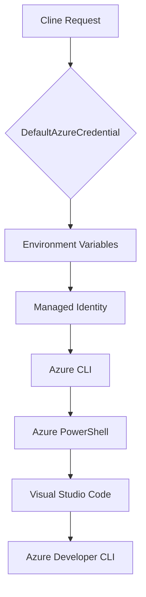

### Overview

Azure Identity authentication allows Cline to use your existing Azure CLI session to authenticate with Azure AI Foundry. This is the **recommended approach** for developers because:

- ✅ No API keys to manage or rotate
- ✅ Leverages your existing Azure RBAC permissions
- ✅ Supports MFA and conditional access policies
- ✅ Automatic token refresh
- ✅ Works with Azure Government and Azure Stack

---

### Prerequisites

Before configuring Cline, ensure you have:

1. **Azure CLI** installed ([Install Azure CLI](https://docs.microsoft.com/cli/azure/install-azure-cli))
2. **Active Azure subscription** with an Azure AI Foundry resource
3. **Cognitive Services User** role (or higher) on the Azure OpenAI resource

---

### Step 1: Install Azure CLI

<Tabs>
  <Tab title="Windows">
    **Option 1: MSI Installer (Recommended)**
    
    Download and run the [Azure CLI MSI installer](https://aka.ms/installazurecliwindows).
    
    **Option 2: PowerShell**
    ```powershell
    winget install Microsoft.AzureCLI
    ```
    
    **Option 3: Chocolatey**
    ```powershell
    choco install azure-cli
    ```
  </Tab>
  <Tab title="macOS">
    **Homebrew (Recommended)**
    ```bash
    brew update && brew install azure-cli
    ```
    
    **Manual Installation**
    ```bash
    curl -L https://aka.ms/InstallAzureCli | bash
    ```
  </Tab>
  <Tab title="Linux">
    **Ubuntu/Debian**
    ```bash
    curl -sL https://aka.ms/InstallAzureCLIDeb | sudo bash
    ```
    
    **RHEL/CentOS/Fedora**
    ```bash
    sudo rpm --import https://packages.microsoft.com/keys/microsoft.asc
    sudo dnf install azure-cli
    ```
  </Tab>
</Tabs>

Verify installation:
```bash
az --version
```

---

### Step 2: Authenticate with Azure

#### Azure Commercial Cloud

```bash
az login
```

This opens a browser window for authentication. After signing in, you'll see your subscriptions listed.

#### Azure Government Cloud

```bash
az cloud set --name AzureUSGovernment
az login
```

#### Azure Stack

```bash
az cloud register -n AzureStack --endpoint-resource-manager "https://management.local.azurestack.external"
az cloud set -n AzureStack
az login
```

<Tip>
**Multiple Accounts?** Use `az account list` to see all accounts and `az account set --subscription "Your Subscription"` to switch.
</Tip>

---

### Step 3: Verify Azure Permissions

You need the **Cognitive Services User** role on your Azure OpenAI resource. Check your access:

```bash
az role assignment list --assignee $(az ad signed-in-user show --query id -o tsv) \
  --scope /subscriptions/{subscription-id}/resourceGroups/{resource-group}/providers/Microsoft.CognitiveServices/accounts/{resource-name}
```

If you don't have access, ask your Azure administrator to grant:

```bash
az role assignment create \
  --role "Cognitive Services User" \
  --assignee {your-email@domain.com} \
  --scope /subscriptions/{subscription-id}/resourceGroups/{resource-group}/providers/Microsoft.CognitiveServices/accounts/{resource-name}
```

<Note>
**Minimum Required Permissions:**
- `Microsoft.CognitiveServices/accounts/deployments/read` — List deployments
- `Microsoft.CognitiveServices/accounts/deployments/completions/action` — Invoke models
</Note>

---

### Step 4: Configure Cline

1. **Open Cline Settings**
   - Click the settings gear ⚙️ in the Cline panel

2. **Select Microsoft Foundry**
   - Choose **Microsoft Foundry** from the API Provider dropdown

3. **Enter Endpoint URL**
   - Paste your Azure AI Foundry endpoint (e.g., `https://my-resource.cognitiveservices.azure.com`)

4. **Select Cloud Environment**
   - Choose **Commercial**, **Government**, or **Stack**

5. **Enable Azure Identity**
   - Check the **Use Azure Identity** checkbox
   - Leave the API Key field empty

6. **Discover Deployments**
   - Click **Discover Deployments** to fetch available models
   - This uses your Azure CLI credentials to list deployments

7. **Select a Deployment**
   - Choose your desired model from the dropdown

---

### Step 5: Test the Connection

Send a test message in Cline:

```
Hello! Can you confirm you're connected through Azure AI Foundry?
```

If successful, you'll see a response from your deployed model.

---

### Troubleshooting

<AccordionGroup>
  <Accordion title="'Azure CLI session expired' error">
    Your Azure CLI token has expired. Run:
    ```bash
    az login
    ```
    Then retry in Cline.
  </Accordion>
  
  <Accordion title="'Insufficient permissions' error">
    You don't have the required RBAC role. Ask your Azure administrator to grant:
    - **Cognitive Services User** role on the Azure OpenAI resource
    
    Or for more restrictive access:
    - **Cognitive Services OpenAI User** role
  </Accordion>
  
  <Accordion title="'Deployment not found' error">
    Verify:
    1. The deployment exists in Azure AI Foundry portal
    2. The deployment name matches exactly (case-sensitive)
    3. The deployment is in the same resource as your endpoint
  </Accordion>
  
  <Accordion title="'AADSTS' authentication errors">
    These are Azure AD errors. Common causes:
    - MFA required but not completed
    - Conditional access policy blocking
    - Account disabled or locked
    
    Try `az login --use-device-code` for alternative authentication.
  </Accordion>
  
  <Accordion title="Connection works in Azure Portal but not Cline">
    The Azure CLI and browser sessions are separate. Ensure:
    1. You're logged into Azure CLI (`az account show`)
    2. The correct subscription is selected
    3. The CLI token hasn't expired
  </Accordion>
</AccordionGroup>

---

### How It Works

When you enable Azure Identity, Cline uses the **DefaultAzureCredential** chain from the Azure Identity SDK:



For local development, this typically resolves to your **Azure CLI** credentials.

<Note>
In production environments (Azure VMs, App Service, AKS), DefaultAzureCredential automatically uses **Managed Identity** — no code changes required.
</Note>

---

### Security Best Practices

1. **Use Conditional Access** — Configure Azure AD policies to require MFA for CLI access
2. **Session Timeouts** — Set token lifetime policies appropriate for your security requirements
3. **Audit Logs** — Monitor Azure AI Foundry usage through Azure Monitor
4. **Network Restrictions** — Consider private endpoints for production workloads
5. **Least Privilege** — Grant minimum required RBAC roles

---

### Next Steps

<CardGroup cols={2}>
  <Card title="API Key Authentication" icon="key" href="./api-key">
    Alternative authentication for automation scenarios.
  </Card>
  <Card title="Troubleshooting Guide" icon="wrench" href="./troubleshooting">
    Detailed solutions for common issues.
  </Card>
</CardGroup>
